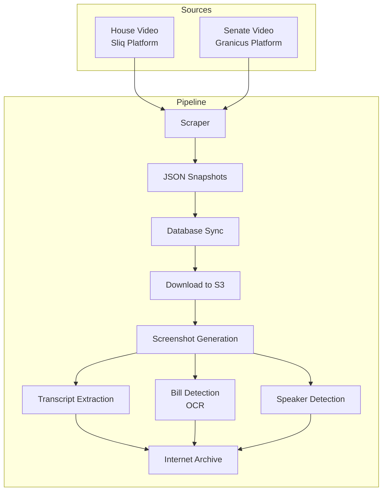

# LLM Instructions

This file provides guidance to LLMs for working with code in this repository.

## About This Project

Richmond Sunlight Video Processor is a standalone pipeline for collecting, processing, and archiving Virginia General Assembly legislative video. It scrapes video metadata from the House and Senate, downloads videos to S3, generates screenshots, extracts transcripts, detects bills being discussed via OCR, identifies speakers, and uploads finalized assets to the Internet Archive.

This repository is part of the `richmondsunlight.com` collection:
- `richmondsunlight.com` - Main website (PHP front-end, source of shared `includes/` directory)
- `rs-api` - Public JSON API
- `rs-machine` - Data ingestion and processing (scrapers, parsers, cron jobs)
- `rs-video-processor` (this repo) - Video ingestion and analysis

## Common Development Commands

### Local Development Setup

**Start the local Docker environment:**
```bash
./docker-run.sh
```

This script builds and starts the container with PHP, ffmpeg, and other required tooling. The first run copies `deploy/settings-docker.inc.php` to `includes/settings.inc.php` if it doesn't exist.

**Stop the Docker environment:**
```bash
./docker-stop.sh
```

### Testing

**Run all tests:**
```bash
./docker-tests.sh
```

This runs PHPUnit inside the Docker container. The test suite includes 40+ unit and integration tests.

**Run tests on native host (requires ffmpeg):**
```bash
./includes/vendor/bin/phpunit
```

Tests self-skip if prerequisites (ffmpeg, MP4 fixtures, API keys) are missing.

**Fetch test video fixtures:**
```bash
php bin/fetch_test_fixtures.php
```

Downloads sample MP4 files from `video.richmondsunlight.com/fixtures` for integration testing.

### Dependency Management

**Install dependencies:**
```bash
composer install
```

Note: Composer is configured to install dependencies to `includes/vendor/` rather than the default `vendor/` directory (matching the richmondsunlight.com pattern).

### Running CLI Scripts

All scripts bootstrap via `bin/bootstrap.php`. Key entry points:

```bash
# Scrape metadata from House/Senate sources
php bin/scrape.php

# Download videos to S3
php bin/fetch_videos.php --limit=N

# Screenshot generation (enqueue mode for control plane)
php bin/generate_screenshots.php --enqueue

# Screenshot generation (worker mode for analysis box)
php bin/generate_screenshots.php --limit=N

# Transcript extraction
php bin/generate_transcripts.php --enqueue|--limit=N

# Bill detection via OCR
php bin/detect_bills.php --enqueue|--limit=N

# Speaker identification
php bin/detect_speakers.php --enqueue|--limit=N

# Upload to Internet Archive
php bin/upload_archive.php --limit=N

# Full pipeline orchestration
php bin/pipeline.php
```

## Architecture Overview

### Distributed Queue-Based Design

The system runs across two server configurations:

1. **Lightweight Control Plane** (EC2 Micro instance, shared with rs-machine)
   - Scraping and metadata collection
   - Video downloading to S3
   - Job enqueueing for analysis tasks

2. **Heavy Analysis Workers** (GPU-capable EC2 instance)
   - Screenshot generation (ffmpeg)
   - Transcript processing (OpenAI Whisper)
   - Bill detection (Tesseract OCR)
   - Speaker detection (diarization)

**Gating:** Analysis only runs if `/home/ubuntu/video-processor.txt` exists on the instance.

### Queue System

Production uses AWS SQS FIFO queue (`rs-video-harvester.fifo`). In Docker/tests, falls back to an in-memory queue automatically.

```php
// Queue selection is automatic via QueueFactory
$queue = $factory->build($queueUrl, $config);
```

### Directory Structure

```
rs-video-processor/
├── bin/                          # CLI entry points
│   ├── bootstrap.php             # Application initialization
│   ├── scrape.php                # Metadata collection
│   ├── fetch_videos.php          # Download to S3
│   ├── generate_screenshots.php  # 1 FPS frame extraction
│   ├── generate_transcripts.php  # Audio transcription
│   ├── detect_bills.php          # OCR-based bill detection
│   ├── detect_speakers.php       # Speaker identification
│   ├── upload_archive.php        # Internet Archive uploads
│   └── pipeline.php              # End-to-end orchestrator
├── src/                          # Core application code (PSR-4)
│   ├── Bootstrap/                # App initialization
│   ├── Scraper/                  # House/Senate metadata collection
│   │   ├── House/                # Sliq platform scraper
│   │   └── Senate/               # Granicus platform scraper
│   ├── Sync/                     # Database synchronization
│   ├── Fetcher/                  # Video downloading
│   ├── Screenshots/              # Frame extraction
│   ├── Transcripts/              # Audio transcription
│   ├── Analysis/                 # Content analysis
│   │   ├── Bills/                # Bill detection via OCR
│   │   └── Speakers/             # Speaker identification
│   ├── Archive/                  # Internet Archive uploads
│   └── Queue/                    # Job orchestration (SQS/in-memory)
├── includes/                     # Shared helpers (from richmondsunlight.com)
│   ├── settings.inc.php          # Configuration constants
│   ├── class.Log.php             # Logging with Slack integration
│   ├── class.Database.php        # PDO connection wrapper
│   └── vendor/                   # Composer dependencies
├── tests/                        # PHPUnit test suite
│   └── fixtures/                 # Test data (HTML, MP4s, JSON)
├── storage/                      # Local file storage
│   ├── scraper/                  # Scraped metadata snapshots
│   ├── pipeline/                 # Pipeline output files
│   └── screenshots/              # Local screenshot cache
└── deploy/                       # Deployment configuration
```

### Data Flow



### Key Design Patterns

**Pluggable Interfaces:**
- `HttpClientInterface` - Swap HTTP implementations
- `OcrEngineInterface` - Replace Tesseract with OpenAI Vision or AWS Rekognition
- `DiarizerInterface` - Swap speaker detection providers
- `QueueInterface` - SQS or in-memory

**Processor Pattern:**
Each analysis step has a dedicated processor class that handles job orchestration, execution, and result persistence.

**Idempotency:**
- Enqueue mode is safe to run repeatedly
- Worker mode acknowledges jobs only after successful processing
- Database prevents duplicate inserts

### Database Integration

Uses the same MariaDB schema as `richmondsunlight.com`. Key tables:

- `files` - Video metadata (id, chamber, committee_id, title, path, dimensions, date)
- `video_index` - Per-second analysis results (file_id, time, type, linked_id)
- `video_transcript` - Transcript segments (file_id, start_time, end_time, text)
- `people` - Legislator directory for speaker matching
- `committees` - Committee metadata

**No schema migrations required** - works with existing richmondsunlight.com definitions.

## Configuration

### Required Constants

Configuration is in `includes/settings.inc.php`. Key constants:

```php
// Database
PDO_DSN, PDO_USERNAME, PDO_PASSWORD

// AWS
AWS_ACCESS_KEY, AWS_SECRET_KEY, AWS_REGION
VIDEO_SQS_URL  // rs-video-harvester.fifo queue URL

// APIs
OPENAI_KEY              // For transcription fallback
IA_ACCESS_KEY, IA_SECRET_KEY  // Internet Archive

// Optional
SLACK_WEBHOOK           // Logging integration
```

For Docker development, use `deploy/settings-docker.inc.php` as a template.

### S3 Bucket Structure

Videos and screenshots are stored in `video.richmondsunlight.com`:

```
video.richmondsunlight.com/
├── house/
│   ├── floor/
│   │   └── YYYYMMDD/
│   │       ├── video.mp4
│   │       └── screenshots/
│   └── {committee}/
│       └── YYYYMMDD/
└── senate/
    ├── floor/
    └── {committee}/
```

## Coding Standards

### Style Guide

Follow **PSR-12** coding standards. The repository uses modern PHP 8.1+ patterns:
- Typed properties and return types
- Constructor property promotion
- Named arguments where clarity helps

### Variable and Function Naming

- Variables: `$camelCase` in new code, `$snake_case` in legacy includes
- Methods: `camelCase()` in src/, `snake_case()` in includes/
- Classes: `PascalCase`
- Constants: `UPPER_SNAKE_CASE`

### Autoloading

PSR-4 autoloader maps:
- `RichmondSunlight\VideoProcessor\` → `src/`

Legacy code in `includes/` uses require/include.

## Video Source Details

### House Video (Sliq Platform)

- Base URL: `https://sg001-harmony.sliq.net/`
- Listing endpoint: `/en/api/Data/GetListViewData`
- Detail pages contain JavaScript objects: `mediaStartTime`, `AgendaTree`, `downloadMediaUrls`, `Speakers`
- Rate limited: 1 request/second

### Senate Video (Granicus Platform)

- Base URL: `https://virginia-senate.granicus.com/`
- Listing: `/ViewPublisher.php?view_id=3`
- Detail pages parsed from HTML tables
- Rate limited: 1 request/second

## Analysis Details

### Screenshot Generation

- Extracts 1 frame per second via ffmpeg
- Generates two sizes per frame (full resolution + thumbnail)
- Uploads to S3 with predictable naming for downstream OCR

### Transcript Processing

**Priority order:**
1. Existing WebVTT/SRT captions (preferred - reduces API costs)
2. OpenAI Whisper API fallback

Audio is resampled to MP3 (mono, 32 Kbps, 16 kHz, <25 MB chunks) before API submission.

### Bill Detection

- OCR-based chyron detection from screenshots
- Chamber-specific crop regions:
  - **Senate:** Bill number in top-right (dark red background)
  - **House:** Bill info in top banner (translucent gray background)
- Falls back to House agenda data when OCR fails
- Results stored in `video_index` table (type='bill')

### Speaker Detection

- House: Extracts from cached `Speakers` metadata object
- Senate: OpenAI diarization for speaker boundaries
- Fuzzy-matches names to `people` table for legislator IDs
- Results stored in `video_index` (type='legislator')

## Deployment

### Production Infrastructure

- Scraping/enqueueing runs on rs-machine EC2 instance (always-on, low-cost)
- Analysis workers run on separate GPU-capable instance (started on-demand)
- Deployed via GitHub Actions → AWS CodeDeploy
- Gated by presence of `/home/ubuntu/video-processor.txt`

### EC2 Instance Management

The video processor EC2 instance is expensive and only started when there's work to do. The `rs-machine` repository contains a cron script (`cron/start_video_processor.php`) that:

1. Checks for videos needing processing (download, screenshots, transcripts, bill detection, speaker detection, archive)
2. Queries the instance state via AWS EC2 API
3. Starts the instance only if work is pending and it's not already running

This runs every 30 minutes during legislative hours (noon-9 PM) via crontab.

### CI/CD Pipeline

1. PHP syntax linting
2. Composer install
3. PHPUnit test suite
4. Deploy to CodeDeploy (on master branch)

## Development Tips

- **Always use Docker for testing** - ensures ffmpeg and other dependencies are available
- **Queue fallback is automatic** - in-memory queue used when SQS unavailable
- **Test fixtures are large** - run `bin/fetch_test_fixtures.php` to download sample videos
- **Check the gating file** - analysis won't run without `/home/ubuntu/video-processor.txt`
- **Scraper output is JSON** - check `storage/scraper/` for debugging metadata collection

## Relationship to Other Repositories

| Repository | Relationship |
|------------|--------------|
| richmondsunlight.com | Source of `includes/` directory (shared classes, settings) |
| rs-api | Consumes `video_index` and `video_transcript` data |
| rs-machine | Triggers video processor EC2 instance; provides committee/legislator data; runs `cron/start_video_processor.php` |

## Known Design Decisions

### Duplicate Video Detection

Videos are deduplicated using a composite key of `chamber|date|duration_seconds`. This is handled by:
- `ExistingFilesRepository` - reads existing videos from database, builds keys from `length` column
- `MissingVideoFilter` - compares scraped records against existing keys

The duration (in seconds) is used rather than video URL because URLs can change between scrapes while the video content remains the same.

### Speaker Metadata Formats

The `SpeakerMetadataExtractor` supports two formats:
- Raw Sliq format: `Speakers` array with `text` and `startTime` fields
- Normalized format: `speakers` array with `name` and `start_time` fields

This flexibility allows processing both raw scraped data and normalized pipeline output.

### Subcommittee Handling

Subcommittees use the same crop configuration as committees for bill detection OCR, since their video layouts are typically identical.

This is a production-critical system that processes legislative video for public transparency. Changes should be tested thoroughly before deployment.
